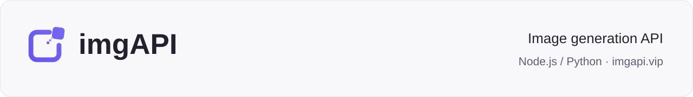

<p>
<a href="https://imgapi.vip/"><picture>
  <source media="(max-width: 600px)" srcset="assets/readme-hero-mobile.svg">
  
</picture></a>
</p>

# imgAPI — AI Image Generation API Examples

**Node.js and Python examples** for GPT Image 2, GPT Image 2.5 and Nano Banana: text-to-image, reference images and asynchronous task polling.

[Get an API Key](https://imgapi.vip/) · [API docs & pricing](https://imgapi.vip/api-docs) · [Quickstart](#quickstart) · [简体中文](README.md)

[](https://github.com/shanyeai/imgapi-image-generation/actions/workflows/test.yml)

## Quickstart

Requires Node.js 22+ or Python 3.10+. Choose either runtime.

```bash
git clone https://github.com/shanyeai/imgapi-image-generation.git
cd imgapi-image-generation
```

**1. Preview a request.** Choose either command. No Key or dependencies are needed, and no image task is submitted.

```bash
node node/run.mjs --dry-run --request examples/quickstart.json
# Or Python
python python/run.py --dry-run --request examples/quickstart.json
```

The output contains `"mode": "dry-run"`, `"network": false` and the request fields. [See the complete output and verification scope](docs/request-preview.md). Previewing helps inspect your prompt and parameters; it does not validate provider acceptance or generate an image.

**2. Set your Key.** When ready for a real call, get a CardKey from [imgapi.vip](https://imgapi.vip/) and replace the placeholder. The scripts do not load `.env` automatically. Keep your Key in a terminal or server environment.

```bash
# macOS / Linux
export IMGAPI_CARD_KEY='YOUR_16_HEX_CARD_KEY'
```

<details>
<summary>Windows PowerShell</summary>

```powershell
$env:IMGAPI_CARD_KEY = 'YOUR_16_HEX_CARD_KEY'
```

</details>

**3. Generate one image.** The default is GPT Image 2, 1K, 1:1. This submits one real task and uses credits under the service's billing rules.

```bash
# Node.js: no dependencies required
node node/run.mjs --request examples/quickstart.json
```

```bash
# Python
python -m pip install -r python/requirements.txt
python python/run.py --request examples/quickstart.json
```

On success, the CLI prints the **task ID and image URL**. Asynchronous IDs are saved to `task-id.txt` in your current directory.

**4. Save the image.** Replace the placeholder below with the complete returned image URL, including any query parameters. Choose an unused filename and save the result before the URL expires. Do not include your CardKey in the download request.

```bash
# macOS / Linux: quotes protect characters such as & in the URL
curl --fail --location --output result.png 'PASTE_RETURNED_IMAGE_URL_HERE'
```

<details>
<summary>Windows PowerShell</summary>

```powershell
Invoke-WebRequest -Uri 'PASTE_RETURNED_IMAGE_URL_HERE' -OutFile 'result.png'
```

</details>

`result.png` is an example filename, not a format conversion. Use an extension matching the actual image format. Do not publish signed download URLs.

## Choose an example

Both languages accept the same JSON. Replace the `--request` file above:

| Use case | Request file | What to change |
| --- | --- | --- |
| Text to image | [quickstart.json](examples/quickstart.json) | `prompt` |
| Product photo concept | [product-photo.json](examples/product-photo.json) | Product description |
| Article cover | [article-cover.json](examples/article-cover.json) | Topic and composition |
| Image to image | [reference-edit.json](examples/reference-edit.json) | Supply your own `reference.png` |

[Reference image and parameter notes](examples/README.md). These are input recipes, not paid generation benchmarks.

## Supported models

| Model | JSON `model` value |
| --- | --- |
| GPT Image 2 | `gpt-image-2` |
| GPT Image 2.5 | `gpt-image-2.5`, `gpt-image-2.5-flare`, `gpt-image-2.5-sunburst` |
| Nano Banana 2 | `nano-banana-2` |
| Nano Banana Pro | `nano-banana-pro` |

Edit `model` in the request JSON. See [imgAPI documentation](https://imgapi.vip/api-docs) for current availability, supported parameter combinations and pricing.

## Resume or integrate

Resume an existing task with `node node/run.mjs --query YOUR_TASK_ID` or `python python/run.py --query YOUR_TASK_ID`. If submission is uncertain, check the dashboard before creating another task.

You can also read the saved ID. The file retains only the most recently written ID:

```bash
# macOS / Linux; use python python/run.py for the Python client
node node/run.mjs --query "$(cat task-id.txt)"
```

```powershell
# Windows PowerShell
node node/run.mjs --query (Get-Content -LiteralPath 'task-id.txt' -Raw).Trim()
```

Import [`createImgApiClient`](node/imgapi.mjs) or [`ImgApiClient`](python/imgapi.py) into an existing application; see the [integration guide](docs/integration.md). This API uses its own JSON protocol, not a drop-in OpenAI SDK base URL.

[Troubleshooting](docs/troubleshooting.md) · [Issues](https://github.com/shanyeai/imgapi-image-generation/issues) · [Contributing & offline tests](CONTRIBUTING.md) · [Creator kit](docs/creator-kit.md)

## License

The code and documentation in this repository are available under the [MIT License](LICENSE), including modification, integration and commercial use subject to its notice requirements. The imgAPI hosted service remains subject to its service and billing terms.

CI validates offline examples, not live image quality or service uptime.
