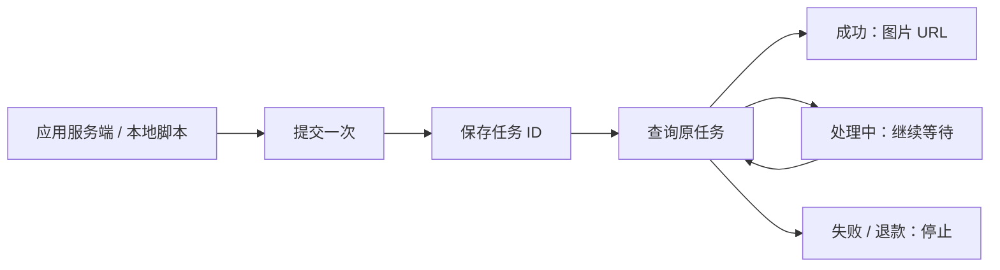

<p align="center">
  <a href="https://imgapi.vip/">
    <picture>
      <source media="(max-width: 600px)" srcset="assets/readme-hero-mobile.svg">
      
    </picture>
  </a>
</p>

<h1 align="center">imgAPI Image Generation</h1>
<p align="center"><strong>把图片生成接进你的应用。</strong><br>Node.js 与 Python 接入示例 · 参考图上传 · 异步轮询 · 任务恢复</p>

<p align="center">
  <a href="https://github.com/shanye1402-hash/imgapi-image-generation/actions/workflows/test.yml"></a>
  
</p>

<p align="center"><a href="#先试一下不需要-key也不消耗积分">快速开始</a> · <a href="docs/integration.md">接入指南</a> · <a href="examples/README.md">场景示例</a> · <a href="docs/creator-kit.md">创作者资料</a> · <a href="README.en.md">English</a><br><a href="https://imgapi.vip/">imgAPI 官网</a> · <a href="https://imgapi.vip/api-docs">API 文档</a> · <a href="https://github.com/shanye1402-hash/imgapi-image-generation/issues">反馈问题</a></p>

---

> **无需 Key 即可开始** — 先运行 `npm run demo` 预览请求。真实生成需配置 CardKey，并按服务规则消耗积分。

面向电商工具、内容工作台和 AI 应用开发者。默认模型为 `gpt-image-2`，更多模型与价格见 [服务文档](https://imgapi.vip/api-docs)。

## 先试一下：不需要 Key，也不消耗积分

需要 Node.js 22+ 或 Python 3.10+。克隆后任选一种语言：

```bash
git clone https://github.com/shanye1402-hash/imgapi-image-generation.git
cd imgapi-image-generation
node node/run.mjs --dry-run
# 或：python python/run.py --dry-run
```

预览会打印 `mode: "dry-run"`、`network: false`、接口地址和 JSON 请求参数。它不请求服务器、不生成图片，也不代表模型参数或参考图已通过服务端校验。Python 预览无需安装依赖。

## 选一个场景

| 你想做什么 | 可运行输入 | 预览命令 |
| --- | --- | --- |
| 跑通首次调用 | [quickstart.json](examples/quickstart.json) | `npm run demo` |
| 做商品主图概念稿 | [product-photo.json](examples/product-photo.json) | `node node/run.mjs --dry-run --request examples/product-photo.json` |
| 做文章封面底图 | [article-cover.json](examples/article-cover.json) | `python python/run.py --dry-run --request examples/article-cover.json` |
| 保持参考图中的商品外观 | [参考图说明](examples/README.md) | 在自己的 JSON 中设置 `files` 或 `urls` |

场景文件是可修改的输入样例，目前没有对应的付费实测结果或质量保证。

## 生成第一张图

在 [imgAPI 官网](https://imgapi.vip/) 获取 CardKey，设置到终端或服务端环境变量。下面是占位符；换成自己的 16 位十六进制 Key。

```powershell
# Windows PowerShell
$env:IMGAPI_CARD_KEY = 'YOUR_16_HEX_CARD_KEY'
```

```bash
# macOS / Linux
export IMGAPI_CARD_KEY='YOUR_16_HEX_CARD_KEY'
```

Node.js 无需安装依赖：

```bash
node node/run.mjs --request examples/product-photo.json
```

Python 先安装 HTTP 客户端：

```bash
python -m pip install -r python/requirements.txt
python python/run.py --request examples/product-photo.json
```

**去掉 `--dry-run` 会提交一次真实生图任务，按服务规则消耗积分。** `.env.example` 是配置说明，脚本不会自动加载 `.env`。不要将 Key 放入请求 JSON、浏览器代码或 `NEXT_PUBLIC_*` / `VITE_*` 等公开变量。

异步任务会先打印 ID 并写入当前目录的 `task-id.txt`，随后轮询、输出图片 URL。单次同步成功可能直接返回图片。图片链接应及时保存；脚本不会自动下载图片。

## 中断后继续查，不再提交

```bash
node node/run.mjs --query YOUR_TASK_ID
# 或：python python/run.py --query YOUR_TASK_ID
```

`--query` 始终查询原任务。提交超时或断网时，服务端可能已经受理，不要直接重跑生成命令；如果没有拿到 ID，先到控制台核对。`task-id.txt` 只记录最近一次异步任务，批量接入请使用自己的任务存储。



## 接入已有项目

| 内容 | 入口 |
| --- | --- |
| Node.js / Python 调用方式、参数和参考图 | [接入指南](docs/integration.md) |
| Key、错误响应、等待超时、路径问题 | [排错指南](docs/troubleshooting.md) |
| 技术博主演示提纲、可引用事实、素材要求 | [创作者资料包](docs/creator-kit.md) |
| 报告 Bug、贡献新场景 | [贡献说明](CONTRIBUTING.md) · [Issues](https://github.com/shanye1402-hash/imgapi-image-generation/issues) |

API Base URL 为 `https://imgapi.vip/prod-api`。服务端提交 `POST /tool/imgapi/draw/Async`，查询 `POST /tool/gptimage2/query`。请求体通过 `key` 认证；这套接口不是 OpenAI SDK 的直接替换地址。

## 如何验证

```bash
npm test
python -m pip install -r python/requirements.txt
python -m unittest discover -s tests -p "test_*.py"
```

测试使用离线模拟响应，覆盖提交、轮询、参考图、错误处理和 CLI 预览；不需要真实 Key。CI 状态仅证明代码检查结果，不代表线上 API 可用率、模型质量或生成速度。

如果示例帮你完成了接入，欢迎收藏仓库，或通过 [使用案例模板](https://github.com/shanye1402-hash/imgapi-image-generation/issues/new?template=showcase.yml) 分享你的项目和可复现步骤。

仓库暂未添加开源许可证；需要复用授权时请先联系维护者。
